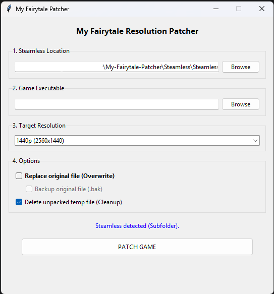
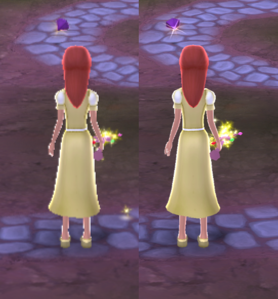

# Disney Princess: My Fairytale Adventure - Resolution Patcher

A simple, automated tool to patch *Disney Princess: My Fairytale Adventure* to run at modern resolutions (**1080p, 1440p, 4K**) without stretching or visual artifacts.

This tool functions as a wrapper that can automatically unpack (using **Steamless**) and patch the game's internal code to render strictly at your chosen resolution.

It has only been tested with the Steam version of the game.

Patcher Screenshot         |  Resolution Comparison
:-------------------------:|:-------------------------:
  |  

## Features
* **Supports:** 1920x1080, 2560x1440, and 3840x2160 (4K).
* **Auto-Unpacker:** Integrates with **[Steamless](https://github.com/atom0s/Steamless)**.
* **Smart Patching:** Updates both the Window creation logic AND the internal 3D Renderer to fix aspect ratio stretching.
* **Safety:** Options to backup the original file (`.bak`) and clean up temporary unpacked files.

---

## 📥 How to Use (For Gamers and Parents)

If you just want to fix your game, download the latest release.

### 1. Setup
1.  Download the latest `.zip` from the **[Releases](../../releases)** page.
2.  Extract the folder to your desktop (or anywhere).
3.  **Crucial:** Ensure the `Steamless` folder is present inside the extracted folder. The tool needs this to unlock the game file. You can always download the latest version from **[Steamless releases](https://github.com/atom0s/Steamless/releases/)**

### 2. Patching
1.  Run **`MyFairytalePatcher.exe`**.
2.  It should say *"Steamless detected (Subfolder)"* at the bottom.
3.  Click **Browse** under "Game Executable" and select your `DisneyPrincess.exe` (usually in `C:\Program Files (x86)\Steam\steamapps\common\Disney Princess My Fairytale Adventure`).
4.  Select your desired resolution (e.g., **1440p**).
5.  Check **"Replace original file"** (this will auto-check "Backup original file").
6.  Click **PATCH GAME**.

*The tool will unpack the file, patch the code, create a backup, and overwrite the game exe automatically.*

---

## 🐍 Running from Source (For Developers)

If you prefer to run the script via Python or build it yourself.

### Prerequisites
* Python 3.x
* Required libraries: `tkinter` (usually built-in)

### Installation
1.  Clone the repository:
    ```bash
    git clone https://github.com/kapoios/My-Fairytale-Patcher.git
    cd My-Fairytale-Patcher
    ```
2.   Download the latest version of **[Steamless](https://github.com/atom0s/Steamless/releases/)** and place the `Steamless` folder inside the project root if you want auto-unpacking to work.

### Running the Script
```bash

python My-Fairytale-Patcher.py


